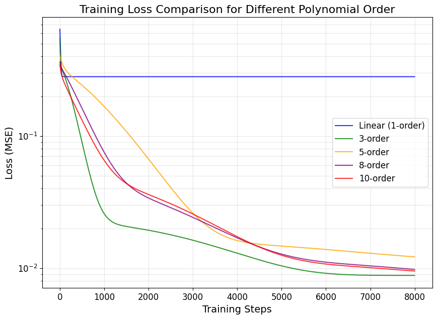

# Polynomial Expansion Rank Adaptation: Enhancing Low-Rank Fine-Tuning with High-Order Interactions

<p align="center">
  🔥 <b>Accepted at ACL 2026 (Findings)</b> 🔥
</p>

---

<p align="center">
  
</p>

<p align="center">
  <b>Figure 1:</b> Training loss comparison across different methods.
</p>

---

## 💡 Motivation

From the perspective of function approximation, there exists a fundamental difference in expressive capacity between first-order linear functions and higher-order polynomial functions. 

For example:

- Linear: $f(x)=c + c_1 x$  
- Polynomial: $f(x)=c + c_1 x + c_2 x^2 + \dots + c_n x^n$

This gap directly leads to substantial differences in **fitting accuracy**, **convergence speed**, and **training loss**.

If we interpret traditional LoRA as a first-order linear approximation of weight updates, its limitations in expressive capacity become evident.

---

## 🚀 Method: PERA

PERA introduces a novel parameter-efficient fine-tuning (PEFT) approach for large language models (LLMs) by incorporating **structured polynomial expansion** into the low-rank adaptation space.

- ✅ Explicit high-order interaction modeling  
- ✅ Enhanced nonlinear expressivity  
- ✅ No additional inference overhead  
- ✅ Maintains LoRA efficiency  

By generating high-order interaction terms among low-rank factors, PERA enables richer nonlinear coupling without increasing rank, leading to consistent improvements across:

- Commonsense reasoning  
- Natural language understanding  

---

## 🧩 Implementation

Our codebase is built upon **HiRA**.

---

## Repository Structure

```
.
├── README.md
├── customized_trainer
│   └── customized_trainer.py         # Customized trainer implementation
├── data_file                          # Raw datasets for various tasks
│   └── ...                            # (Subfolders include convai2, llm_adapt, etc.)
├── dataset
│   ├── dataset_hg.py                 # Data loader for heterogeneous datasets
│   ├── dataset_hg_combined.py        # Combined dataset handling
│   └── format_inputs.py              # Functions for formatting model inputs
├── env.yml                           # Environment configuration for Conda
├── eval_commonsense.py                    # Evaluation script for commonsense reasoning
├── hira                              # PERA core modules and tuners
│   ├── peft_model.py                 # Implementation of HiRA and related PEFT models
│   ├── mapping.py                    # Mapping utilities for adapting models
│   ├── import_utils.py               # Helper functions for model import and setup
│   └── tuners                        # Various PEFT tuners (e.g., lora, prefix, p_tuning)
│       └── ...                       # Tuners implementations (lora.py, prefix_tuning.py, etc.)
├── models
│   └── get_models.py                 # Functions to load pre-trained models and HiRA variants
├── paper
│   └── Polynomial_Expansion_Rank_Adaptation__Enhancing_Low_Rank_Fine_Tuning_with_High_Order_Interactions.pdf
└── train_hira.py                   # Main entrance script for training and evaluation
```

## Overview

We are inspired by the fundamental difference between first-order and higher-order terms in mathematics.

---

### 🔹 LoRA Update

The update for LoRA is:

$$
\Delta W = BA = \sum_{i=1}^{r} b_i a_i^{T}
$$

---

### 🔹 PERA Update

PERA reformulates the update step for LLMs as:

$$
\Delta W = \mathrm{Poly2}(B)\mathrm{Poly2}_H(A)
= \sum_{i=1}^{r} b_i a_i^{T}
+ \sum_{i=1}^{r} h_i (b_i \odot b_i)(a_i^{T} \odot a_i^{T})
+ \sum_{1 \le i < j \le r} h_{ij} (b_i \odot b_j)(a_i^{T} \odot a_j^{T})
$$

---

where:

- **$W_0$** is the frozen pre-trained weight matrix  
- **$A$** and **$B$** are low-rank matrices  
- **$\odot$** denotes the elementwise (Hadamard) product  

---

This formulation enables PERA to achieve richer nonlinear interactions and a higher effective rank, while keeping computational costs and the number of trainable parameters comparable to LoRA.## Installation

1. **Clone the Repository:**

   ```bash
   git clone https://github.com/hqsiswiliam/hira.git
   cd hira
   ```

2. **Set Up the Environment:**

   We recommend using Conda with the provided `env.yml` file:

   ```bash
   conda env create -f env.yml
   conda activate hira
   ```

3. **Install Dependencies:**

   Ensure that required packages such as `torch`, `transformers`, `numpy`, `tqdm`, `python-dotenv`, and `jsonlines` are installed. The Conda environment should handle these dependencies.

## Quick Start

### Single GPU Training Example

For training on a single GPU, use the following command:

```bash
python train_hira.py \
--peft_type=hira \
--model=meta-llama/Meta-Llama-3-8B \
--r_ab=32 \
--enable_grad_ckpt --epoch=3 --lr=1e-3 --batch=16 \
--dataset=common_170k --seed=36 \
--warmup=100 --eval_strategy=steps --eval_steps=80 \
--output_folder=results_hira --target_modules=q_proj,k_proj,v_proj,up_proj,down_proj
```

This command fine-tunes the Meta-Llama-3-8B model on the `common_170k` dataset using HiRA. Key options include:

- **--peft_type=hira:** Selects the HiRA adaptation method.
- **--model=meta-llama/Meta-Llama-3-8B:** Specifies the pre-trained model.
- **--r_ab=32:** Sets the HiRA-specific hyperparameter.
- **--enable_grad_ckpt:** Enables gradient checkpointing.
- **--epoch, --lr, --batch, --seed, --warmup, --eval_strategy, --eval_steps:** Configure training hyperparameters.
- **--output_folder:** Directory to store training outputs.
- **--target_modules:** Specifies target modules for adaptation.

### Distributed Training with DeepSpeed

For multi-node or multi-GPU distributed training using DeepSpeed, you can use a script similar to the following:

```bash
deepspeed --master_port=29500 --num_gpus=4 --num_nodes=2 --hostfile=hostfile train_hira.py \
--peft_type=hira \
--model=meta-llama/Meta-Llama-3-8B \
--r_ab=32 \
--enable_grad_ckpt --epoch=3 --lr=1e-3 --batch=16 \
--dataset=common_170k --ds_config=ds_configs/ds_config_fp16_z3.json --seed=36 \
--warmup=100 --eval_strategy=steps --eval_steps=80 \
--output_folder=results_hira --target_modules=q_proj,k_proj,v_proj,up_proj,down_proj
```

For one-node with multi-GPU training using DeepSpeed, you can use a script similar to the following:

```bash
deepspeed --master_port=29500 --num_gpus=4 --num_nodes=1 train_hira.py \
--peft_type=hira \
--model=meta-llama/Meta-Llama-3-8B \
--r_ab=32 \
--enable_grad_ckpt --epoch=3 --lr=1e-3 --batch=16 \
--dataset=common_170k --ds_config=ds_configs/ds_config_fp16_z3.json --seed=36 \
--warmup=100 --eval_strategy=steps --eval_steps=80 \
--output_folder=results_hira --target_modules=q_proj,k_proj,v_proj,up_proj,down_proj
```

This example uses DeepSpeed options for training on 1 node with 4 GPUs each.

### Evaluation

You can evaluate your trained models using the provided `run_eval_decoding.sh` script. This script runs evaluation on multiple datasets with a beam size of 4. To use the script, supply the checkpoint path as its first argument:

```bash
bash run_eval_decoding.sh /path/to/your/checkpoint
```

The script executes evaluation commands for datasets such as `boolq`, `piqa`, `siqa`, `hellas`, `winog`, `arce`, `arcc`, and `obqa`.

**Content of `run_eval_decoding.sh`:**

```bash
CUDA_VISIBLE_DEVICES=0 python train_hira.py --dataset=boolq --batch=16 --output_folder=temp --ckpt=$1 --beam_size=4
CUDA_VISIBLE_DEVICES=0 python train_hira.py --dataset=piqa --batch=16 --output_folder=temp --ckpt=$1 --beam_size=4
CUDA_VISIBLE_DEVICES=0 python train_hira.py --dataset=siqa --batch=16 --output_folder=temp --ckpt=$1 --beam_size=4
CUDA_VISIBLE_DEVICES=0 python train_hira.py --dataset=hellas --batch=16 --output_folder=temp --ckpt=$1 --beam_size=4
CUDA_VISIBLE_DEVICES=0 python train_hira.py --dataset=winog --batch=16 --output_folder=temp --ckpt=$1 --beam_size=4
CUDA_VISIBLE_DEVICES=0 python train_hira.py --dataset=arce --batch=16 --output_folder=temp --ckpt=$1 --beam_size=4
CUDA_VISIBLE_DEVICES=0 python train_hira.py --dataset=arcc --batch=16 --output_folder=temp --ckpt=$1 --beam_size=4
CUDA_VISIBLE_DEVICES=0 python train_hira.py --dataset=obqa --batch=16 --output_folder=temp --ckpt=$1 --beam_size=4
```

Each command evaluates the model on a specific dataset using a beam size of 4.

## Code Details

- **Data Handling:**  
  - The `dataset` folder includes modules for loading and preprocessing data from various tasks.
  - Data files are organized under `data_file` by task (e.g., `convai2`, `boolq`, etc.).

- **Model & Tuners:**  
  - The core implementations of HiRA and other PEFT methods are located in the `hira` directory.
  - The file `models/get_models.py` contains functions to load pre-trained models and integrate HiRA-based adaptations.

- **Training & Evaluation:**  
  - The main script, `train_hira.py`, orchestrates training, evaluation, and checkpointing.
  - Customized training routines and gradient checkpointing are implemented in `customized_trainer/customized_trainer.py`.

## Data Link
- Download the complete commonsense datasets from [here](https://github.com/AGI-Edgerunners/LLM-Adapters/tree/main/dataset) and download the commonsense 170k finetuning dataset from [here](https://github.com/AGI-Edgerunners/LLM-Adapters/blob/main/ft-training_set/commonsense_170k.json)
- Then put the downloaded file into corresponding folders (e.g., `data_file/llm_adapt`)
- We also provide a [Google drive download link](https://drive.google.com/file/d/1S_tsqJ8zC_L6fJ4bIQKRf0PUDwNV46HE/view?usp=sharing) for the ease of data downloading.
- Please read and accept the DATA_LICENSE before you download.

## About the Paper

For a detailed explanation of the methodology, theoretical analysis, and experimental results, please refer to our paper:

[HiRA Parameter-Efficient Hadamard High-Rank Adaptation for Large Language Models.pdf](./paper/HiRA%20Parameter-Efficient%20Hadamard%20High-Rank%20Adaptation%20for%20Large%20Language%20Models.pdf)

**Key Contributions:**

- **High-Rank Updates:** Achieved through the Hadamard product, enabling increased expressiveness without additional trainable parameters.
- **Efficient Adaptation:** HiRA seamlessly merges with pre-trained weights, introducing no extra inference overhead.
- **Extensive Evaluation:** Superior performance is demonstrated on benchmarks spanning commonsense reasoning, dialogue generation, and mathematical reasoning.

## Citation

If you use this work in your research, please cite:

```bibtex
@inproceedings{
huang2025hira,
title={Hi{RA}: Parameter-Efficient Hadamard High-Rank Adaptation for Large Language Models},
author={Qiushi Huang and Tom Ko and Zhan Zhuang and Lilian Tang and Yu Zhang},
booktitle={The Thirteenth International Conference on Learning Representations},
year={2025},
url={https://openreview.net/forum?id=TwJrTz9cRS}
}
```
